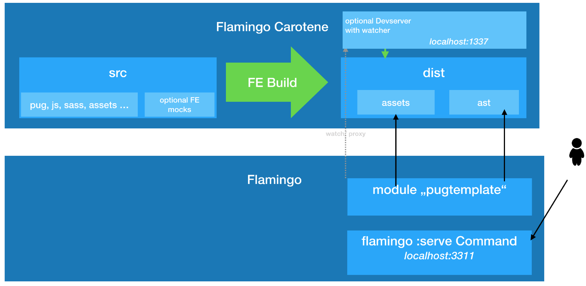

# Flamingo-Carotene

## What is it ?
Flamingo-Carotene is an easy to use frontend (-tooling) for projects with the Flamingo framework.

It introduces a modular concept to provide reusable modules and comes with a collection of yarn/npm packages, that provide useful features for frontend development.

Flamingo-Carotene features pug based templating using [atomic design](/docs/atomic-design.md) as well as having the option to use webpack and sass for the frontend build.

The basic goals for flamingo-carotene are:
* Provide independent frontend development with productivity tools (pug, sass, ES6, …)
* Provide a standalone build of the frontend to build JS, CSS, Asset etc. This build logic is not depending on flamingo and can develop independently from flamingo.
* We prefer a  a styleguide driven development approach, featuring atomic design and following concepts of progressive enhancement

The basic technical design targets of flamingo-carotene are:
1. Independent packages: Your are not forced to use "one default" for your project. Instead you can select which feature you want to use. The flamingo carotene packages are well split (having an individual purpose and following high cohasion low coupling principles).
2. No library lock in: By intention the flamingo-carotene does not force you to use some specific frontend framework (like jquery, vue, angular or react).
3. Freedom: As a result of 2. it is possible to use any javascript framework you might consider useful for your project.


## How to use it
First get the [Flamingo-Carotene core module](./packages/flamingo-carotene-core).
```bash
yarn add flamingo-carotene-core
```

Then add any module you like to use from either the [list of official modules](#official-modules) or external ones.
```bash
yarn add [flamingo-carotene-module-name] [-D]
```

## Modules
The modules generally differ into two types:
 1. modules responsible for the tooling - e.g. to do something in the build process, like webpack.
 2. modules used in the code you will deliver - e.g. to add some behavior to your website, like state manager.

Every module can come with useful exposed configurations, that allow you to configure it to your wishes.

To understand how modules work or if you want to develop and use your own modules read the [how to module](docs/carotene-modules.md).

### List of official modules
- [eslint-config-flamingo-carotene](./packages/eslint-config-flamingo-carotene)
- [flamingo-carotene-babel](./packages/flamingo-carotene-babel)
- [flamingo-carotene-behavior](./packages/flamingo-carotene-behavior)
- [flamingo-carotene-core](./packages/flamingo-carotene-core)
- [flamingo-carotene-dev-server](./packages/flamingo-carotene-dev-server)
- [flamingo-carotene-es-lint](./packages/flamingo-carotene-es-lint)
- [flamingo-carotene-module](./packages/flamingo-carotene-module)
- [flamingo-carotene-postcss](./packages/flamingo-carotene-postcss)
- [flamingo-carotene-pug](./packages/flamingo-carotene-pug)
- [flamingo-carotene-pug-lint](./packages/flamingo-carotene-pug-lint)
- [flamingo-carotene-sass-lint](./packages/flamingo-carotene-sass-lint)
- [flamingo-carotene-smooth-scroll-to](./packages/flamingo-carotene-smooth-scroll-to)
- [flamingo-carotene-static-asset](./packages/flamingo-carotene-static-asset)
- [flamingo-carotene-state-manager](./packages/flamingo-carotene-state-manager)
- [flamingo-carotene-webfont](./packages/flamingo-carotene-webfont)
- [flamingo-carotene-webpack](./packages/flamingo-carotene-webpack)
- [flamingo-carotene-webpack-svg-sprite](./packages/flamingo-carotene-webpack-svg-sprite)

## Flamingo-Carotene and Flamingo
The generated frontend build artefacts plays well together with the flamingo `pugtemplating` flamingo module.

The following picture illustrates this:



# Getting started

If you have an new flamingo project this are the steps to do, to use flamingo-carotene:

## Prepare the Frontend

```
mkdir -p frontend/src
cd frontend
yarn init

yarn add flamingo-carotene-core
yarn add flamingo-carotene-pug

```

This initializes your frontend project:
* flamingo-carotene-core - includes the basic commands and core logic
* flamingo-carotene-pug - includes the Build logi to work with pug


You now can add your first page template with pug:

```
cat frontend/src/page/index.pug
```

And with this command you can start building your frontend:

```
yarn flamingo-carotene build
```

The result is stored in the folder ```frontend/dist```


## Prepare the Flamingo project
You should have a running Flamingo project.

In order to use the generated templates in your flamingo project you need to add the pugtemplate module in your projects main go file:

```
...
import (
    ...
	"flamingo.me/flamingo/core/pugtemplate"
	...
)

...
    []dingo.Module{
        ...
        new(pugtemplate.Module),
        ...
    }

```

## Next Steps

After the first steps you can continue with:

* [Read more about Atomic Design](/docs/atomic-design.md)
* Use the `flamingo-carotene-webpack` package to use webpack to build JS and CSS
* Use the `flamingo-carotene-dev-server` package to benefit from Hot reloading during development
* Use the `flamingo-carotene-behavior` package to add dynmic javascript for your design components
* Use the `flamingo-carotene-state-manager` package to use the page state pattern to communicate and manage state between design components.


## Links to used tools

Read more about the tools used in flamingo carotene packages:

*Yarn and NPM*
- https://yarnpkg.com/en/
- https://www.npmjs.com/

*PUG for templating*
- https://pugjs.org/api/getting-started.html

*Sass for CSS*
- http://sass-lang.com/

*Webpack for Build*
- http://andrewhfarmer.com/webpack-hmr-tutorial/


