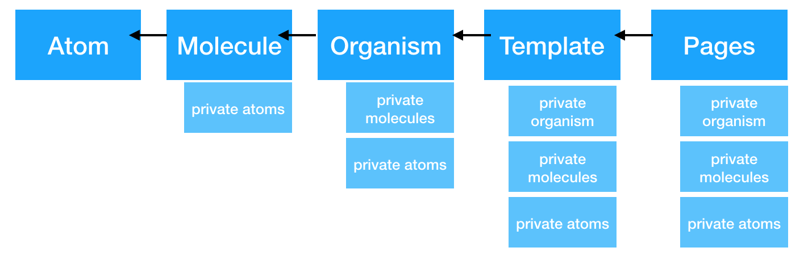

# About Atomic Design

Atomic design ([http://atomicdesign.bradfrost.com/](http://atomicdesign.bradfrost.com/)) is an approach to build the pages for your web application where:

*   The goal is to build a "design system" with clear defined and reusable components

Atomic design distiguishs between the following "atomic design elements":

## Element Details

*   atom: 
    *   **atoms of our interfaces serve as the foundational building blocks that comprise all our user interfaces**
    *   Smallest unit - should not be composed itself of smaller units
    *   Example: a Button, a Label, an Input Field
*   molecule
    *   **molecules are relatively simple groups of UI elements functioning together as a unit**
    *   Example: searchbox with input and button
*   organism
    *   **Organisms are relatively complex UI components composed of groups of molecules and/or atoms and/or other organisms**
    *   **example: complex Slider, menustructure**
*   **template:**
    *   ****Templates are page-level objects that place components into a layout and articulate the design’s underlying content structure.**
        **
    *   ******provides context for these relatively abstract molecules and organisms**
        ****
    *   ********focus on the page’s underlying content structure** rather than the page’s final content
        ******
*   ****page****
    *   ******Pages are specific instances of templates that show what a UI looks like with real representative content in place**
        ****

## Dependency Rules

### Public and Private Molecules

*   The first folder level is considered the main design system and includes public elements
*   Each element may have a second folder level, which can be used to define PRIVATE elements
    *   Private elements help to keep an overview on big websites
    *   Its not allowed to use private elements from other first level elements (they only belong to the parent element)
*   It is good to have private elements:
    *    especially under templates and pages that helps having an overview and not to "pollute" the public elements with elements that are anyhow just intented to be used on THAT template or THAT page

### Dependency Rules

Only higher level elements are allowed to include or use lower level elements:

Overview

### Example structure:

*   atom
    *   button
    *   price
*   molecule
    *   pagination
    *   searchbar
*   organism
    *   productwidget
*   template
    *   base
        *   molecule
            *   header  (private to the template)
            *   footer  (private to the template)
    *   checkout (template for checkout, extends template/base)
        *   molecule
            *   stepnavigation (private to the template)
*   page
    *   home  (e.g. use template/base)
    *   product (e.g. use template/base)
    *   checkout (e.g. use template/checkout)

### Rules

*   Each element should live in a FOLDER, the Foldername matches the elementname
    *   The folder contains the definitons in seperate files:
        *   elementname.pug    (for html)
        *   elementname.saas   (for the styles)
        *   ...js

*   CSS should be bounded to the element:
    *   elementname.pug should define a top level element with a classname matching the elementname
    *   elementname.saas 
        *   should use this classname as a parent, so that the defined styles matches the element
        *   it should not rely on parent classes in other elements NOR should it modify styles from included subelements

*   Templates
    *   Should use "block" definitions to define the content structure
*   **No other public element (atom, molecule or organism) should define blocks**
*   Atom, Molecule, Organism:
    *   Should never rely on data passed to pages
    *   Instead if the support dynamic data, the MUST use a mixin and define and document a use case oriented data structure that need to be passed
