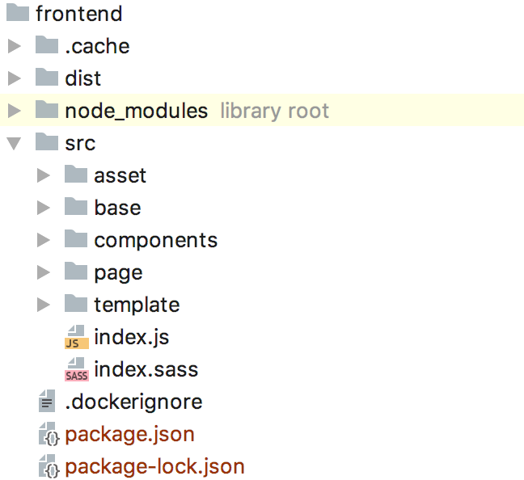

# Getting Started with Flamingo Carotene

## Precondition

Install npm (https://www.npmjs.com/get-npm)

## Intro

This "Getting Started" Tutorial will guide you through the initial steps to have flamingo carotene running for your flamingo project.
The Flamingo Carotene will go inside a folder "frontend" in your flamingo project. 

Once you are done this will be the folder structure:



* "src" folder is where all your frontend code is living.
* "dist" folder is where the frontend build result is saved to by the build command. This folder is not part of version control.
* "node_modules" Managed by npm - contains the dependencies and should not be manged by version control.
* package.json  - the package informations of your frontend.
* package-lock.json - the pinned versions of your (npm) dependencies - should be under version control.

And now lets walk through the steps:


## 1. Prepare the Frontend

Inside your Flamingo project folder:

```bash
mkdir -p frontend/src
cd frontend
npm init    # just confim default values
npm i -D flamingo-carotene-core flamingo-carotene-pug
```

This will first create the folder `frontend/src` - this is where the code for your frontend lives.
After this we use npm to initialize our frontend package and add the basic flamingo_carotene modules.
So after executing the code above your frontend project has the following npm modules included:

* `flamingo-carotene-core` - includes the basic commands and core logic
* `flamingo-carotene-pug` - includes the Build logic to work with pug


You now can add your first page template with pug:

```bash
mkdir -p src/page/
echo "h1 Hello World" >  src/page/index.pug
```

And with this command you can start building your first frontend:

```bash
npx flamingo-carotene build
```

The result is stored in the folder `frontend/dist`. 
The `dist` folder is the folder where the flamingo server will later read the templates.

So the principal development process for frontend is: (1) you work inside `src` folder and the frontend build process writes into the `dist` folder which is read by the flamingo server.
(You should make sure that `frontend/dist` and all other npm cahce folders are added to your `.gitignore` file to avoid having them under version control)

### 1.1. Add the default error templates

Add the templates for the default error pages that flamingo will use for error handling later.
Sp please create the following files inside the folder `frontend/src/page/error/`

* 404.pug
* 403.pug
* 503.pug
* withCode.pug

With a content like this (adjust it to your needs):
```pug
html
  body
    h1.center 503

    if config('debug.mode')
      .errorDebug
        .errorDebugTitle Debug:
        pre.errorDebugContent.center= error
```

Then don't forget to recompile the templates with: `npx flamingo-carotene build`

### 1.2. Adding typical flamingo-carotene modules

#### 1.2.1. Sass via webpack:
Probably you also want to use Sass to write your CSS - therefore we add the webpack module to our frontend:
 
Adding webpack carotene module:
```
npm i -D flamingo-carotene-webpack
```

Now add the entry `index.js` file and use this to load the sass files:

```bash
echo "import 'index.sass'" >  src/index.js
echo "@import 'FILEPATTER*.sass'" >  src/index.sass
```

You can now start adding *.sass files to your templates and will get the css compiled into the dist folder automatically when you run `npx flamingo-carotene build`

#### 1.2.2. Copy assets

In order to use assets (images, webfonts..) in our frontend and make sure they are also copied over to the `dist` folder during build you need to add:

```
npm i -D flamingo-carotene-static-asset
```

## 2. Prepare the Flamingo project
If you already have a running Flamingo project, this are the steps you need to adjust in order to use the templates generated by Flamingo Carotene:

### 2.1. Add the pugtemplate module in your projects main go file:

```go
import (
  // ...
	"flamingo.me/pugtemplate"
	// ...
)

func main() {
    // ...
    flamingo.App([]dingo.Module{
      // ...
      new(pugtemplate.Module),
      // ...
    })
}
```

Thats it. So we just add the pugtemplate engine to the bootstrap and can start using the pug templates.
(Make sure other flamingo template engines like gotemplate are removed.)


## 3. Next Steps

After the first steps you can continue with:

* Read more about the used Tools "pug" and "sass" (see link list below)
* [Read more about Atomic Design](03-atomic-design.md)
* Use the `flamingo-carotene-webpack` package to use webpack to build JS and CSS
* Use the `flamingo-carotene-dev-server` package to benefit from Hot reloading during development
* Use the `flamingo-carotene-behavior` package to add dynamic javascript for your design components
* Use the `flamingo-carotene-state-manager` package to use the page state pattern to communicate and manage state between design components.


## 4. Links to used tools

Read more about the tools used in Flamingo Carotene modules:

* *NPM*
  * https://www.npmjs.com/

* *PUG for templating*
  * https://pugjs.org/api/getting-started.html

* *Sass for CSS*
  * http://sass-lang.com/

* *Webpack for JS / CSS Build*
  * https://webpack.js.org/
